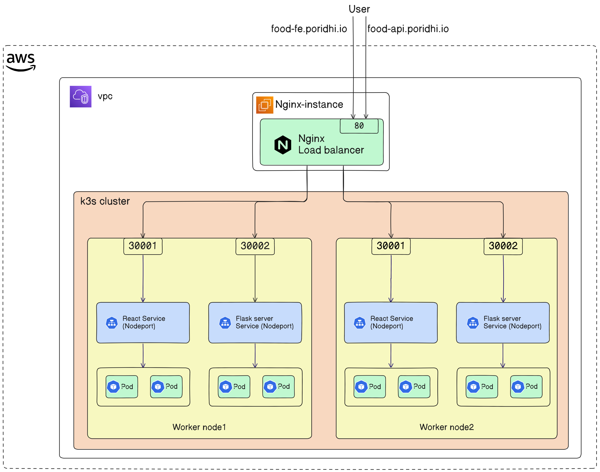

## Installation-of-K3s-and-Nginx-layer-7-load-balancing-on-React-flask-Application

This project demonstrates how to provision cloud infrastructure and deploy containerized applications using modern DevOps tooling.  
The goal is to simulate a small production-like environment where infrastructure is created with **Infrastructure as Code**, services are containerized, and deployed into a lightweight Kubernetes cluster.

The project includes:

- AWS infrastructure provisioning using Pulumi
- Containerized Flask backend
- Containerized React frontend
- k3s Kubernetes cluster with worker nodes
- Nginx Layer 7 load balancer
- DNS mapping for local testing

---





# Architecture Overview

```
User
  |
  v
Local DNS (hosts file)
  |
  v
Nginx Layer 7 Load Balancer
  |
  v
k3s Kubernetes Cluster
  |                |
  v                v
React Frontend     Flask Backend
(NodePort)         (NodePort)
```

Workflow:

1. Infrastructure is created in AWS using **Pulumi**
2. Flask and React applications are containerized with **Docker**
3. Images are pushed to **Docker Hub**
4. A **k3s Kubernetes cluster** is created on EC2 instances
5. Applications are deployed inside the cluster
6. **Nginx** acts as a Layer 7 load balancer
7. Local DNS mapping allows testing using a domain name

---

# Tech Stack

* AWS EC2
* Pulumi (Infrastructure as Code)
* Docker
* Docker Hub
* k3s (Lightweight Kubernetes)
* Nginx
* React
* Flask
* Linux

---

# Project Structure

```
.
├── aws-k3s-infra/                # Infrastructure provisioning
│
├── flask-server/                 # Backend Flask application
│   ├── Dockerfile
│   └── app.py
│
├── react-app/                    # Frontend React application
│   ├── Dockerfile
│   └── src/
│
├── menifest/                     # Kubernetes manifests
│   ├── flask-deployment.yaml
│   ├── react-deployment.yaml
│   └── Nginx/
│       └── nginx.conf            # Load balancer configuration
├── architecture-design/
│   └── architecture.png       
│
└── README.md
```

---

# 1. Infrastructure Provisioning (Pulumi)

Create AWS infrastructure using Pulumi.

```bash
cd aws-k3s-infra
pulumi up
```

Resources created:

* EC2 instances
* Security groups
* Networking configuration

---

# 2. Build and Push Docker Images

## Flask Backend

Build image:

```bash
docker build -t <dockerhub-username>/flask-server ./flask-server
```

Push image:

```bash
docker push <dockerhub-username>/flask-server
```

---

## React Frontend

Build image:

```bash
docker build -t <dockerhub-username>/react-app ./react-app
```

Push image:

```bash
docker push <dockerhub-username>/react-app
```

---

# 3. Configure SSH Access

Edit SSH config:

```
~/.ssh/config
```

Example:

```
Host k3s-master
  HostName <master-public-ip>
  User ubuntu
  IdentityFile ~/.ssh/aws-key.pem

Host k3s-worker1
  HostName <worker-public-ip>
  User ubuntu
  IdentityFile ~/.ssh/aws-key.pem
```

Connect using:

```bash
ssh k3s-master
```

---

# 4. Install k3s Cluster

## Install on Master Node

```bash
curl -sfL https://get.k3s.io | sh -
```

Get node token:

```bash
sudo cat /var/lib/rancher/k3s/server/node-token
```

---

## Join Worker Node

Run on worker nodes:

```bash
curl -sfL https://get.k3s.io | \
K3S_URL=https://<master-private-ip>:6443 \
K3S_TOKEN=<node-token> sh -
```

Verify nodes:

```bash
kubectl get nodes
```

---

# 5. Deploy Applications to k3s

Deploy using Kubernetes manifests.

```bash
kubectl apply -f k8s/
```

Verify:

```bash
kubectl get pods
kubectl get svc
```

---

# 6. Configure Nginx Load Balancer

Example configuration:

```
upstream react_app {
    server <worker1-ip>:<nodeport>;
    server <worker2-ip>:<nodeport>;
}

server {
    listen 80;

    location / {
        proxy_pass http://react_app;
    }
}
```

Restart nginx:

```bash
sudo systemctl restart nginx
```

---

# 7. Configure Local DNS

Edit hosts file:

```
/etc/hosts
```

Example:

```
<nginx-public-ip>  myapp.local
```

Access application:

```
http://myapp.local
```

---

# Testing

Test using curl:

```bash
curl http://myapp.local
```

Or open in browser:

```
http://myapp.local
```

Expected behavior:

* React frontend loads
* API calls reach Flask backend
* Nginx distributes traffic correctly

---

# Learning Outcomes

This project demonstrates:

* Infrastructure provisioning with Pulumi
* Docker image creation and registry usage
* Kubernetes cluster setup with k3s
* Deploying containerized applications
* Layer 7 load balancing with Nginx
* End-to-end DevOps deployment workflow

---


